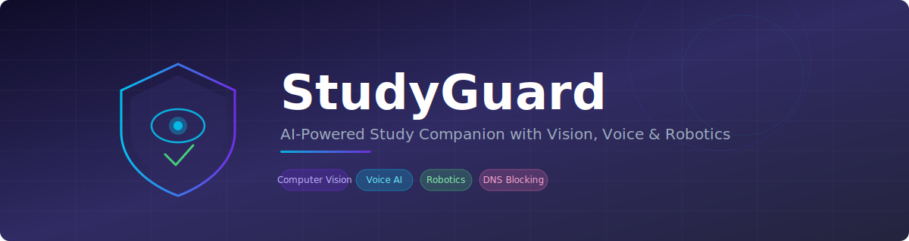
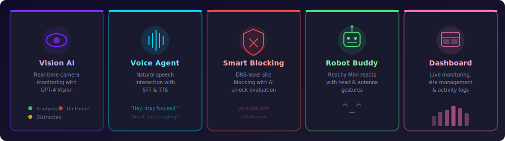

<p align="center">
  
</p>

<p align="center">
  
  
  
  
  
</p>

<p align="center">
  <b>An AI-powered study companion that keeps kids focused using computer vision, voice interaction, smart website blocking, and a physical robot buddy.</b>
</p>

---

## Features

<p align="center">
  
</p>

| Feature | Description |
|---------|-------------|
| **Vision Monitoring** | Real-time camera analysis via OpenAI Vision API with live dashboard streaming |
| **Voice Agent** | Natural speech interaction with speech-to-text and text-to-speech |
| **Smart Website Blocking** | DNS-level blocking (YouTube, Instagram, TikTok, Twitter, Reddit) with AI-evaluated unlock requests |
| **Robot Companion** | Reachy Mini reacts to study state changes with head and antenna gestures |
| **Parent Dashboard** | Web UI for live monitoring, site management, activity logs, and system health |
| **Activity Tracking** | SQLite-backed session and event logging with daily stats |

---

## Architecture

<p align="center">
  
</p>

---

## Tech Stack

| Layer | Tools |
|-------|-------|
| Backend | FastAPI, SQLAlchemy, OpenAI API, OpenCV, PyAudio |
| Frontend | Vanilla JS, HTML/CSS (dark theme, IBM Plex Mono) |
| DNS | dnsmasq |
| Robotics | reachy_mini SDK |
| Database | SQLite |

## Project Structure

```
├── backend/
│   ├── main.py             # FastAPI server & startup
│   ├── vision.py           # Camera monitoring & classification
│   ├── voice_loop.py       # Voice agent & speech processing
│   ├── argue.py            # Website access request evaluation
│   ├── reachy_control.py   # Robot gesture control
│   └── database.py         # Models & DB setup
├── frontend/
│   ├── index.html          # Dashboard UI
│   ├── dashboard.js        # Dashboard logic
│   └── style.css           # Styling
├── dns-server/             # DNS config & logs
├── requirements.txt
└── run.sh                  # Startup script
```

---

## Getting Started

### Prerequisites

- Python 3.10+
- OpenAI API key
- Camera and microphone
- Optional: Reachy Mini robot, dnsmasq

### Install

```bash
git clone https://github.com/Nayab-23/SeedHackathon.git
cd SeedHackathon
python -m venv venv
source venv/bin/activate
pip install -r requirements.txt
```

### Configure

Create a `.env` file:

```env
OPENAI_API_KEY=your-key-here

# Optional
DATABASE_URL=sqlite:///./studyguard.db
DNS_LOG_PATH=./dnsmasq.log
CAMERA_INDEX=0
VISION_INTERVAL_SECONDS=10
REACHY_HOST=localhost
REACHY_PORT=8080
STUDYGUARD_AUDIO_SINK=default
STUDYGUARD_AUDIO_SOURCE=default
```

### Run

```bash
./run.sh
# or
uvicorn backend.main:app --host 0.0.0.0 --port 8000
```

Open **http://localhost:8000** for the dashboard.

---

## API

| Endpoint | Description |
|----------|-------------|
| `GET /api/health` | Health check |
| `GET /api/status` | System status |
| `GET /api/stats/today` | Today's study stats |
| `GET /api/camera/stream` | Live MJPEG stream |
| `GET /api/events` | Activity log |
| `GET /api/logs/dns` | DNS query logs |
| `GET /api/blocklist` | Blocked domains |
| `POST /api/blocklist` | Add blocked domain |
| `DELETE /api/blocklist/{domain}` | Unblock domain |
| `POST /api/argue` | Submit access argument |
| `POST /api/voice/listening` | Toggle microphone |
| `GET /api/voice/conversation` | Conversation transcript |
