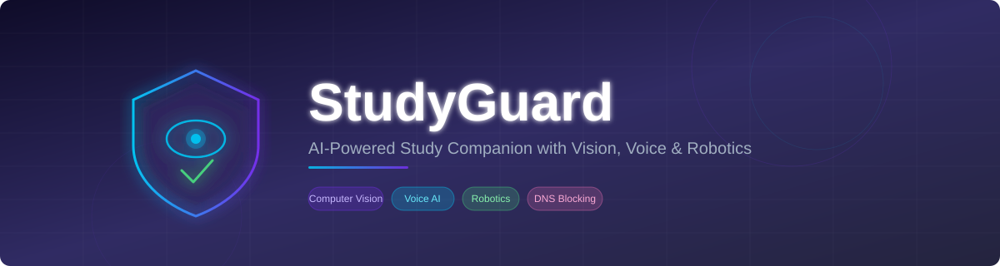
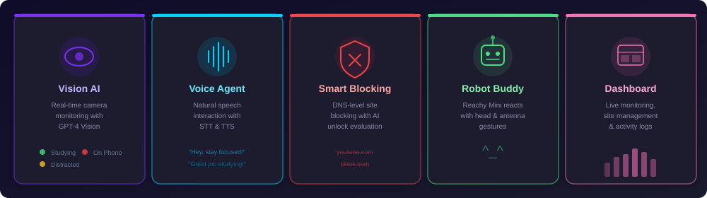
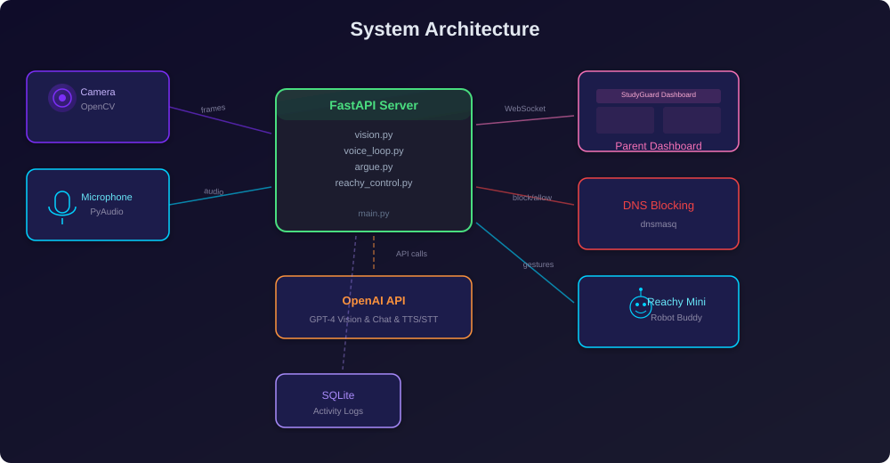

<p align="center">
  
</p>

<p align="center">
  
  
  
  
  
</p>

<p align="center">
  <b>An AI-powered study companion that keeps kids focused using computer vision, voice interaction, smart website blocking, a physical robot buddy, and NVIDIA Omniverse simulation.</b>
</p>

---

## Features

<p align="center">
  
</p>

| Feature | Description |
|---------|-------------|
| **Vision Monitoring** | Real-time camera analysis via the StudyGuard vision pipeline with live dashboard streaming |
| **Voice Agent** | Natural speech interaction with speech-to-text and text-to-speech |
| **Smart Website Blocking** | DNS-level blocking with AI-evaluated unlock requests |
| **Robot Companion** | Reachy Mini reacts to study state changes with head and antenna gestures |
| **Parent Dashboard** | Web UI for live monitoring, site management, activity logs, and system health |
| **Activity Tracking** | SQLite-backed session and event logging with daily stats |
| **NVIDIA Omniverse Simulation** | Isaac Sim synthetic-camera mode for scenario testing before real deployment |

---

## Omniverse Integration

StudyGuard now deeply integrates **NVIDIA Omniverse** and **Isaac Sim** as its simulation and synthetic-data layer. Before real-world deployment, the team uses Omniverse to build and iterate on a virtual study-room environment that mirrors the conditions the system must handle in production.

The Isaac Sim scene includes:

- desk
- chair
- laptop
- book
- notebook
- phone
- lamp
- virtual camera
- robot avatar
- multiple student identities

This simulation layer lets the team test monitoring, identity recognition, attention-state detection, robot feedback, and enforcement flows without depending only on live webcam sessions.

## Synthetic Scenario Coverage

Using **Omniverse / Isaac Sim Replicator**, StudyGuard generates synthetic RGB frames and labels for scenarios such as:

- Jason studying
- Jason using a phone
- Jason distracted
- Nayab detected
- unknown person entering
- bad lighting
- messy desk
- phone occlusion
- side camera angles
- multiple people in frame

Generated labels are structured around identity, study state, and visible objects:

```text
identity = Jason / Nayab / unknown
state = studying / phone_use / distracted
objects = person / phone / book / laptop / notebook
```

When the dashboard triggers **Run NVIDIA Omniverse Simulation Test**, synthetic frames are streamed into StudyGuard through the simulation camera path, then processed by the existing vision pipeline so the normal dashboard logs, robot reactions, identity detection, and DNS blocking behavior all activate exactly as they do in live mode.

---

## Architecture

<p align="center">
  
</p>

StudyGuard is organized across four connected layers:

1. **Edge Compute Layer (NVIDIA Jetson Orin Nano)**: FastAPI backend, DNS controls, state tracking, and local AI orchestration.
2. **Embodied Interface (Reachy Mini)**: Physical robot feedback and interaction.
3. **Simulation + Synthetic Data Layer (NVIDIA Omniverse / Isaac Sim)**: Virtual study-room scene generation, Replicator data generation, and synthetic camera playback.
4. **Parent Communication Layer**: Dashboard visibility, moderation oversight, and activity review.

---

## Tech Stack

| Layer | Tools |
|-------|-------|
| Backend | FastAPI, SQLAlchemy, OpenAI API, OpenCV, PyAudio |
| Frontend | Vanilla JS, HTML/CSS |
| DNS | dnsmasq |
| Robotics | `reachy_mini` SDK |
| Simulation | NVIDIA Omniverse, Isaac Sim, Replicator |
| Database | SQLite |

## Project Structure

```text
├── backend/
│   ├── main.py               # FastAPI server and startup
│   ├── vision.py             # Camera monitoring and classification
│   ├── voice_loop.py         # Voice agent and speech processing
│   ├── argue.py              # Website access request evaluation
│   ├── reachy_control.py     # Robot gesture control
│   ├── database.py           # Models and DB setup
│   └── sim_camera.py         # Omniverse synthetic frame input path
├── frontend/
│   ├── index.html            # Dashboard UI
│   ├── dashboard.js          # Dashboard logic
│   └── style.css             # Styling
├── simulation/               # Omniverse scenes, scripts, frames, and labels
├── robot_photo_demo.py       # Single-frame Reachy camera capture
├── robot_video_360_demo.py   # Reachy 360-degree video capture
├── requirements.txt
└── run.sh                    # Startup script
```

---

## Getting Started

### Prerequisites

- Python 3.10+
- OpenAI API key
- Camera and microphone
- Optional: Reachy Mini robot, dnsmasq, NVIDIA Omniverse / Isaac Sim

### Install

```bash
git clone https://github.com/Nayab-23/SeedHackathon.git
cd SeedHackathon
python -m venv venv
source venv/bin/activate
pip install -r requirements.txt
```

### Configure

Create a `.env` file:

```env
OPENAI_API_KEY=your-key-here

# Optional
DATABASE_URL=sqlite:///./studyguard.db
DNS_LOG_PATH=./dnsmasq.log
CAMERA_INDEX=0
VISION_INTERVAL_SECONDS=10
REACHY_HOST=localhost
REACHY_PORT=8080
STUDYGUARD_AUDIO_SINK=default
STUDYGUARD_AUDIO_SOURCE=default
```

### Run

```bash
./run.sh
# or
uvicorn backend.main:app --host 0.0.0.0 --port 8000
```

Open **http://localhost:8000** for the dashboard.

---

## Reachy Camera Demos

Capture a single PNG photo from the Reachy Mini camera:

```bash
source .reachy-mini-venv/bin/activate
python robot_photo_demo.py --host reachy-mini.local
```

Capture a 10-second video while commanding the robot through a full turn:

```bash
source .reachy-mini-venv/bin/activate
python robot_video_360_demo.py --duration 10 --return-home
```

Both scripts save output under `captures/` by default.

---

## API

| Endpoint | Description |
|----------|-------------|
| `GET /api/health` | Health check |
| `GET /api/status` | System status |
| `GET /api/stats/today` | Today's study stats |
| `GET /api/camera/stream` | Live MJPEG stream |
| `GET /api/events` | Activity log |
| `GET /api/logs/dns` | DNS query logs |
| `GET /api/blocklist` | Blocked domains |
| `POST /api/blocklist` | Add blocked domain |
| `DELETE /api/blocklist/{domain}` | Unblock domain |
| `POST /api/argue` | Submit access argument |
| `POST /api/voice/listening` | Toggle microphone |
| `GET /api/voice/conversation` | Conversation transcript |

## Future Extension

Planned next steps include **MCP support** so tools such as Codex and Claude can directly control Isaac Sim / Omniverse scenario generation for faster synthetic-scene iteration and automated simulation workflows.
